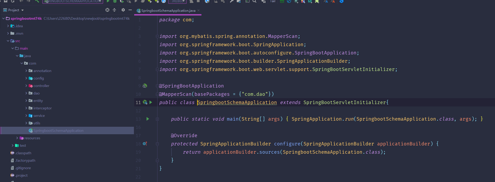
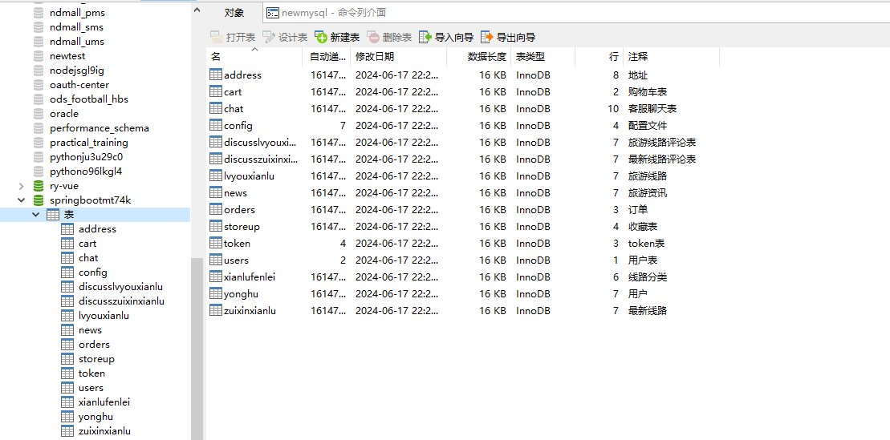
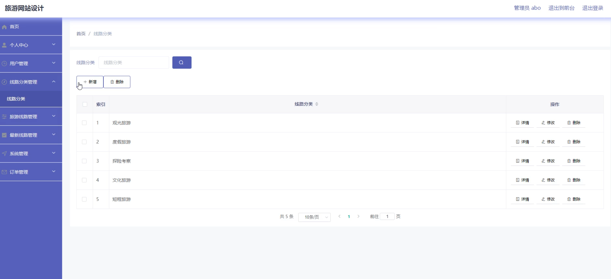
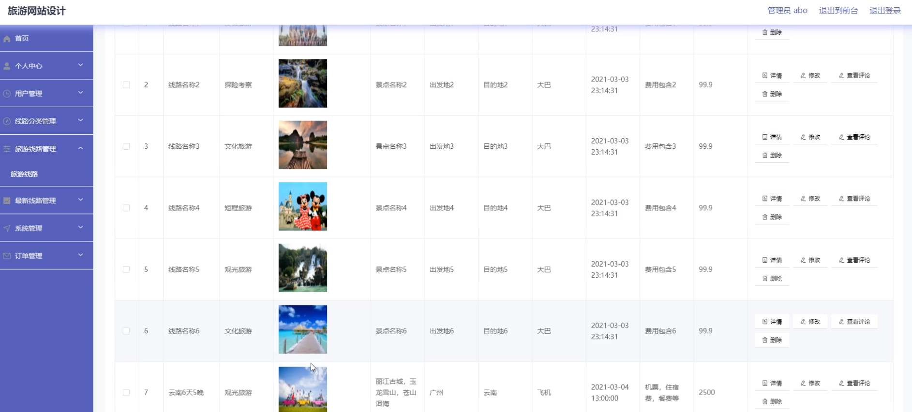
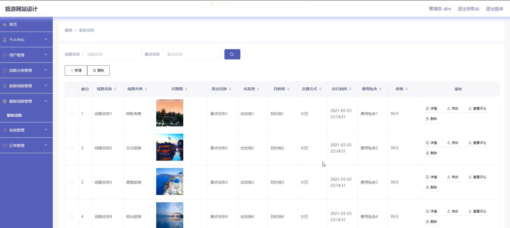
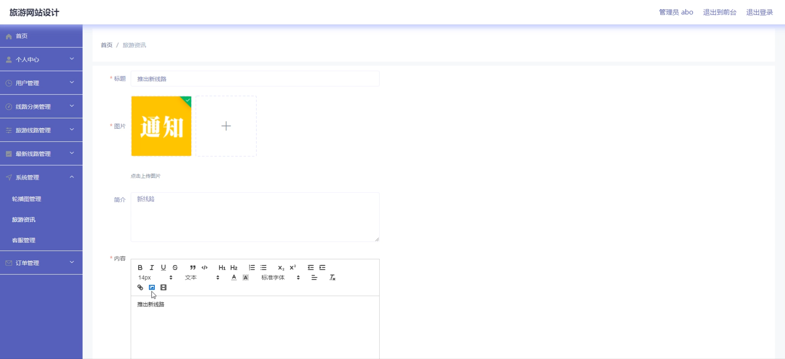
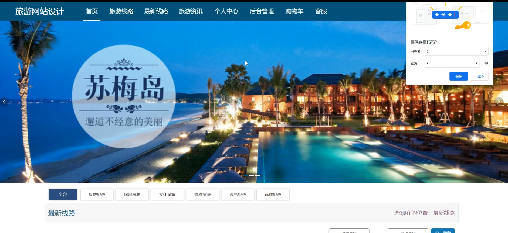
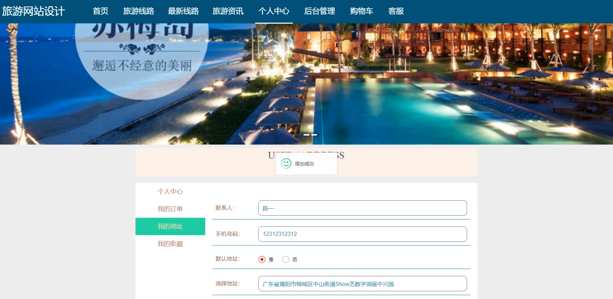
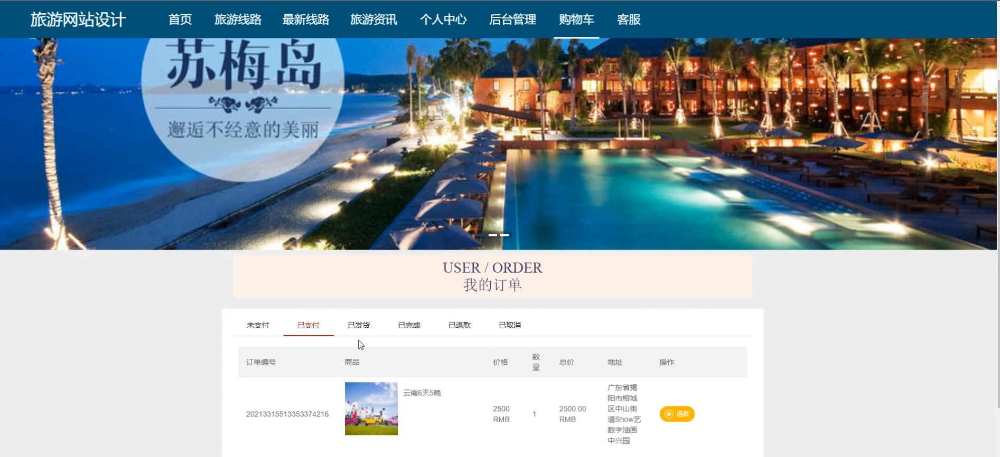
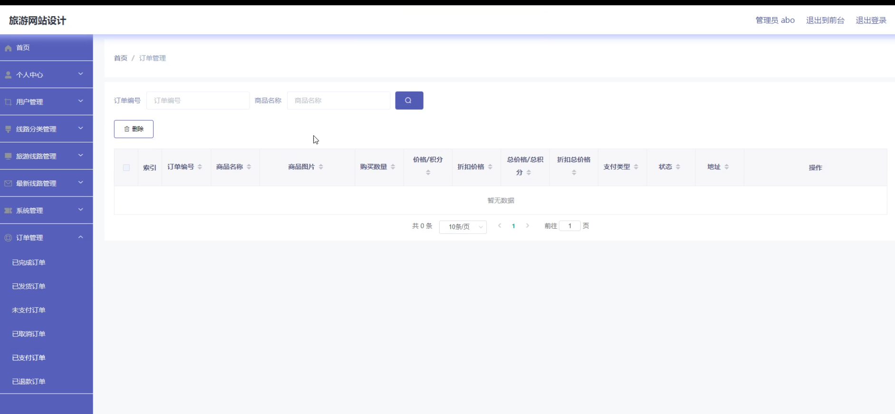

# 基于SpringBoot的旅游网站的设计与实现

---
### 👉作者QQ ：1556708905 微信：zheng0123Long (支持定制修改、部署调试、定制毕设)

### 👉接网站建设、小程序、H5、APP、各种系统等

---

#### 介绍

本系统是一款基于SpringBoot开发的旅游网站，旨在为用户提供便捷的旅游线路查询与预订服务，同时帮助管理端高效地管理旅游资源。系统分为管理端和用户端两种角色，各自拥有不同的功能模块，以满足各自的需求。系统设计直观易用，功能丰富全面，致力于提升用户的旅游体验与管理端的工作效率。

#### 技术栈介绍

后端技术栈：Springboot+Mysql+Maven

前端技术栈：Vue+Html+Css+Javascript+ElementUI

开发工具：Idea+Vscode+Navicate

#### 系统功能介绍

管理端功能模块

个人中心：管理人员可以在个人中心查看和修改个人信息，管理账户安全和偏好设置。

用户管理：管理员可以新增、删除和编辑用户信息，维护用户数据库，确保信息的准确性和安全性。

线路分类管理：管理员可以管理旅游线路的分类信息，为用户提供清晰的分类检索。

旅游线路管理：管理员可以新增、修改、删除和查询旅游线路信息，保证信息的及时更新。

最新线路管理：管理员可以管理最新旅游线路信息，确保用户能够第一时间了解到最新的旅游线路。

系统管理：

轮播图管理：管理员可以更新和管理网站首页的轮播图，提升网站的视觉效果和用户体验。

旅游资讯：管理员可以发布和管理旅游资讯，提供最新的旅游信息和攻略。

客服管理：管理员可以处理用户的客服请求，提升用户服务的质量和效率。

订单管理：管理员可以查看和管理用户的订单信息，确保订单处理的及时性和准确性。

用户端功能模块

旅游线路：用户可以浏览和查询各类旅游线路，了解详细的行程安排和费用信息。

最新线路：用户可以查看最新的旅游线路，第一时间了解最新的旅游资讯和优惠信息。

旅游资讯：用户可以浏览最新的旅游资讯和攻略，获取有价值的旅游信息。

个人中心：用户可以查看和修改个人信息，管理个人账户的安全和偏好设置。

后台管理：用户可以在后台管理中查看和管理自己的订单、收藏等信息。

购物车：用户可以将感兴趣的旅游线路加入购物车，方便集中预订。

客服：用户可以提交客服请求，获取专业的客服支持和帮助。

#### 系统作用

对管理端的作用

高效的用户管理：通过系统化的用户管理，管理员可以轻松维护用户信息，提升管理效率。

全面的线路管理：系统提供完善的旅游线路管理功能，确保线路信息的准确性和及时更新。

高效的订单处理：系统集中管理订单信息，确保订单处理的及时性和准确性，提升用户满意度。

便捷的系统维护：系统管理模块提供了全面的网站维护功能，确保网站内容和视觉效果的及时更新和管理。

对用户端的作用

便捷的线路查询与预订：用户可以轻松浏览和查询旅游线路，了解详细信息并进行预订。

简化的购物流程：通过购物车功能，用户可以方便地将感兴趣的线路加入购物车，提升预订体验。

丰富的旅游资讯：用户可以获取最新的旅游资讯和攻略，提升旅游体验。

高效的客服支持：用户可以通过系统提交客服请求，快速获取专业的客服支持和帮助。

#### 系统功能截图

代码结构

数据库表

登录

线路分类管理

旅游线路管理

最新线路管理

系统管理

首页

个人中心

购物车

订单管理

#### 总结

基于SpringBoot的旅游网站系统通过信息化手段，实现了管理端和用户端的全面功能覆盖，满足了各类用户的需求。系统的高效、便捷、安全的特点，不仅提升了旅游线路的管理效率和服务质量，还通过规范化的管理流程，确保了信息的准确性和透明度。未来，本系统将继续优化和扩展功能，为用户提供更优质的旅游服务和体验。

#### 使用说明

创建数据库，执行数据库脚本 修改jdbc数据库连接参数 下载安装maven依赖jar 启动idea中的springboot项目

后台地址：http://localhost:8080/springbootmt74k/admin/dist/index.html

管理员  abo 密码 abo

前台地址：http://localhost:8080/springbootmt74k/front/index.html

